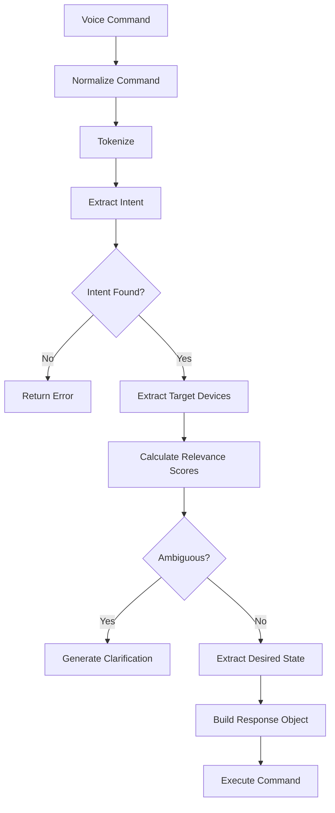

# Intelligent Voice Command Processing System

## Overview

This document describes the advanced Natural Language Understanding (NLU) system implemented for the ESP32 Home Automation web application. The system replaces basic keyword matching with sophisticated language processing capabilities similar to Alexa or Google Assistant.

## System Architecture

### Core Components

1. **Command Normalization**: Cleans and standardizes input
2. **Tokenization**: Breaks commands into analyzable components
3. **Intent Classification**: Determines user's goal
4. **Entity Extraction**: Identifies target devices and desired states
5. **Ambiguity Resolution**: Handles unclear commands gracefully
6. **Command Execution**: Executes parsed commands

### Main Function

```javascript
processIntelligentCommand(command, devices)
```

**Parameters:**
- `command` (string): Raw voice command from user
- `devices` (Array): Available device objects from database

**Returns:**
```javascript
{
    intent: "set_state" | "query_state",
    targets: ["Device Name", ...] | ["all"],
    state?: "ON" | "OFF",
    requires_clarification?: boolean,
    clarification_prompt?: string,
    original_command: string
}
```

## Supported Intents

### 1. Set State (`set_state`)
Controls device power states (on/off).

**Trigger Patterns:**
- Turn/switch on/off
- Activate/deactivate
- Enable/disable
- Start/stop
- Open/close
- Power on/off

**Examples:**
```
"Turn on the living room light"
"Switch off the kitchen fan"
"Activate the bedroom outlet"
"Shut down everything"
```

### 2. Query State (`query_state`)
Checks current device status.

**Trigger Patterns:**
- Is/are [device] on/off/running?
- What is the state of [device]?
- Status of [device]
- Check [device]

**Examples:**
```
"Is the garden light on?"
"What's the status of the kitchen fan?"
"Check the bedroom outlet"
```

## Device Recognition Features

### 1. Flexible Device Matching

The system recognizes devices even when users don't say exact names:

- **Exact Match**: "living room light" matches "Living Room Light"
- **Partial Match**: "light" matches any device with "light" in the name
- **Synonym Recognition**: "lamp" matches devices with "light"
- **Location Separation**: "fan in the kitchen" matches "Kitchen Fan"

### 2. Synonym Support

| Device Type | Recognized Synonyms |
|------------|-------------------|
| Light | light, lamp, bulb, lighting |
| Fan | fan, ventilator, blower |
| Outlet | outlet, socket, plug, power point |

### 3. Location Recognition

| Location | Recognized Variants |
|----------|-------------------|
| Living Room | living room, living, lounge, front room |
| Kitchen | kitchen, cook |
| Bedroom | bedroom, bed room, room |
| Garden | garden, yard, outdoor, outside |

### 4. Bulk Operations

- **All Devices**: "turn off everything", "shut down all devices"
- **Device Type**: "turn on all lights", "switch off all fans"
- **Smart Filtering**: Automatically identifies relevant devices

## Ambiguity Handling

### Detection
The system detects ambiguous commands when:
- Multiple devices have equal relevance scores
- Command doesn't clearly specify which device

### Resolution
When ambiguity is detected:
```javascript
{
    intent: "set_state",
    targets: ["Living Room Light", "Garden Light"],
    state: "ON",
    requires_clarification: true,
    clarification_prompt: "Which light did you mean? Living Room Light or Garden Light?"
}
```

## Scoring Algorithm

The system uses a weighted scoring system to determine device relevance:

| Match Type | Score Weight |
|-----------|-------------|
| Exact device name | 100 points |
| Device name word | 30 points each |
| Location match | 40 points |
| Synonym match | 25 points |

**Example:**
Command: "turn on the kitchen lamp"
- Kitchen Fan: 40 points (location match)
- Kitchen Light: 70 points (40 location + 25 synonym + 30 partial name)
- Living Room Light: 25 points (synonym only)

Winner: Kitchen Light (assuming device name is "Kitchen Light")

## Command Processing Flow



## Example Command Processing

### Example 1: Simple Command
**Input:** "Turn on the living room light"

**Processing:**
1. Normalize: "turn on the living room light"
2. Tokenize: ["turn", "on", "the", "living", "room", "light"]
3. Intent: "set_state" (matches turn on pattern)
4. Target: "Living Room Light" (exact match: 100 points)
5. State: "ON"

**Output:**
```javascript
{
    intent: "set_state",
    targets: ["Living Room Light"],
    state: "ON",
    original_command: "Turn on the living room light"
}
```

### Example 2: Ambiguous Command
**Input:** "Turn on the light"

**Processing:**
1. Intent: "set_state"
2. Targets: Multiple lights found with equal scores
3. Ambiguity detected

**Output:**
```javascript
{
    intent: "set_state",
    targets: ["Living Room Light", "Garden Light"],
    state: "ON",
    requires_clarification: true,
    clarification_prompt: "Which light did you mean? Living Room Light or Garden Light?",
    original_command: "Turn on the light"
}
```

### Example 3: Query Command
**Input:** "Is the kitchen fan running?"

**Processing:**
1. Intent: "query_state" (matches "is...running" pattern)
2. Target: "Kitchen Fan" (location + device type match)

**Output:**
```javascript
{
    intent: "query_state",
    targets: ["Kitchen Fan"],
    original_command: "Is the kitchen fan running?"
}
```

### Example 4: Bulk Command
**Input:** "Turn off all the lights"

**Processing:**
1. Intent: "set_state"
2. Targets: All devices containing "light"
3. State: "OFF"

**Output:**
```javascript
{
    intent: "set_state",
    targets: ["Living Room Light", "Garden Light"],
    state: "OFF",
    original_command: "Turn off all the lights"
}
```

## Error Handling

The system handles various error conditions:

1. **Unrecognized Intent**: Returns null, triggers "Could not understand" message
2. **No Devices Found**: Empty targets array, appropriate error message
3. **Missing State**: For set_state commands without clear on/off indication
4. **Ambiguous Commands**: Clarification prompts instead of guessing

## Performance Optimizations

1. **Efficient Tokenization**: Pre-computed bigrams and trigrams
2. **Regex Compilation**: Patterns compiled once and reused
3. **Scoring Shortcuts**: Early exit for exact matches
4. **Parallel Processing**: Device scoring done in parallel

## Future Enhancements

### Planned Features
1. **Brightness Control**: "Set living room light to 50%"
2. **Timer Commands**: "Turn off the fan in 10 minutes"
3. **Scene Control**: "Set movie scene"
4. **Context Memory**: Remember previous clarifications
5. **Learning System**: Adapt to user preferences over time

### Technical Improvements
1. **Machine Learning**: Neural network for intent classification
2. **Fuzzy Matching**: Handle misspellings and variations
3. **Voice Training**: Personalized command recognition
4. **Multi-language Support**: Support for additional languages

## Integration Guide

### Adding New Device Types
1. Update `deviceSynonyms` object in `extractTargetDevices()`
2. Add corresponding patterns in `extractIntent()`
3. Update scoring logic if needed

### Adding New Intents
1. Define patterns in `extractIntent()`
2. Add handling logic in `executeCommand()`
3. Update return structure documentation

### Customizing Responses
Modify the `executeCommand()` method to customize user feedback messages and behavior.

## Testing Examples

Use these commands to test the system:

**Basic Commands:**
- "Turn on the living room light"
- "Switch off the kitchen fan"
- "Activate the bedroom outlet"

**Synonym Tests:**
- "Turn on the lamp in the living room"
- "Switch off the ventilator"
- "Activate the socket"

**Ambiguity Tests:**
- "Turn on the light" (should ask for clarification)
- "Switch off the fan" (if multiple fans exist)

**Query Tests:**
- "Is the garden light on?"
- "What's the status of the kitchen fan?"
- "Check the bedroom outlet"

**Bulk Commands:**
- "Turn off all lights"
- "Switch on everything"
- "Shut down all devices"

## Troubleshooting

### Common Issues

1. **Device Not Found**: Check device name spelling and synonyms
2. **Intent Not Recognized**: Verify command patterns in `extractIntent()`
3. **Ambiguity Not Detected**: Review scoring algorithm weights
4. **Wrong Device Selected**: Adjust relevance scoring logic

### Debug Mode

Add logging to track processing steps:
```javascript
console.log('Normalized command:', normalizedCommand);
console.log('Extracted intent:', intent);
console.log('Device scores:', deviceScores);
```

This comprehensive system provides a robust foundation for natural language control of IoT devices while maintaining the flexibility to expand and adapt to new requirements.
